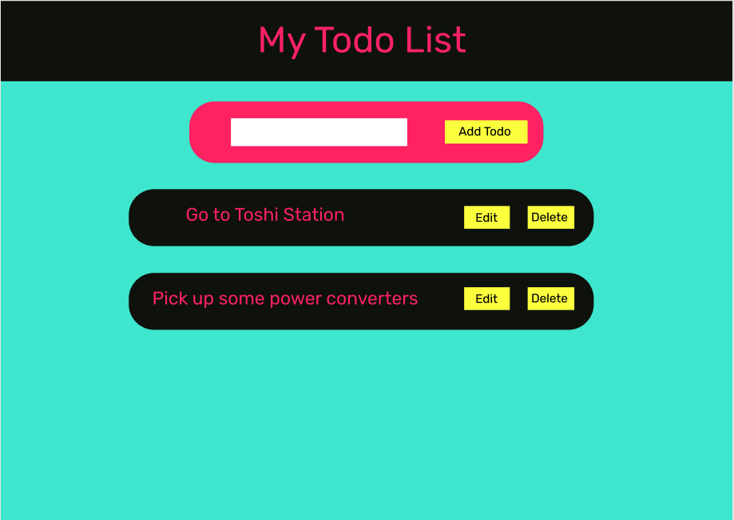

# NoDB Review Plan
<p>"Weeks of coding, hours of planning will you save, mmm?" - Yoda</p>

<hr/>

#### External references:
<a href="https://www.figma.com/file/Jx6eY8CFJDWceGBJogII7M/NoDB-Review?node-id=0%3A1">Wireframe</a></br>
<a href="www.coolers.co">Coolers.co -- make color schemes</a>
<hr/>

### Front End
- Dependencies:
    - npx create-react-app
    - axios

- Organization:
    - App.js
        - Header.js
        - Main.js
            - Form.js
            - Todo.js




### Back End
- Dependencies:
    - express

- Organiztion:
    - server
        - index.js
        - controller.js

- Data Structure:
```JS
{
    id: 1,
    task: "Go to Toshi Station",
    completed: false
}
```

- Endpoints:
    - `app.get('api/todos', ctrl.getTodos)`
    - `app.post('api/todos', ctrl.addTodo)`
    - `app.update('api/todos', ctrl.completeTodo)`
    - `app.delete('api/todos', ctrl.deleteTodo)`